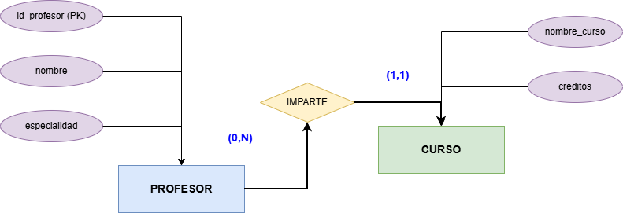
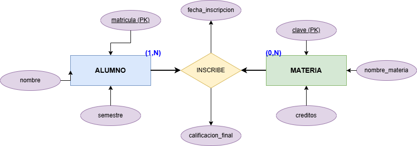
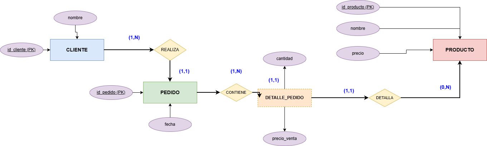
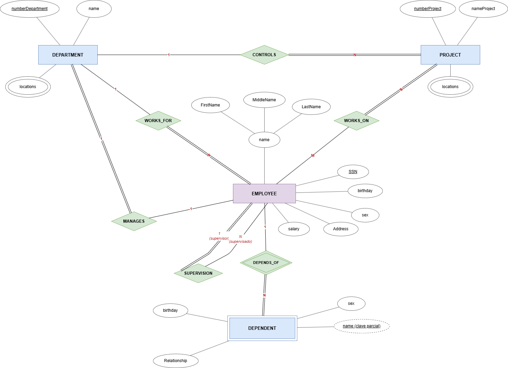
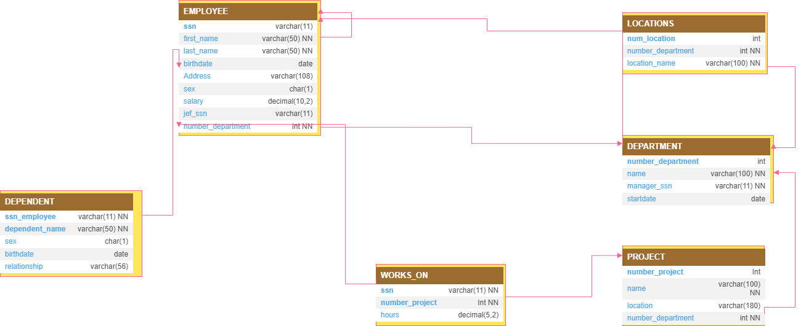
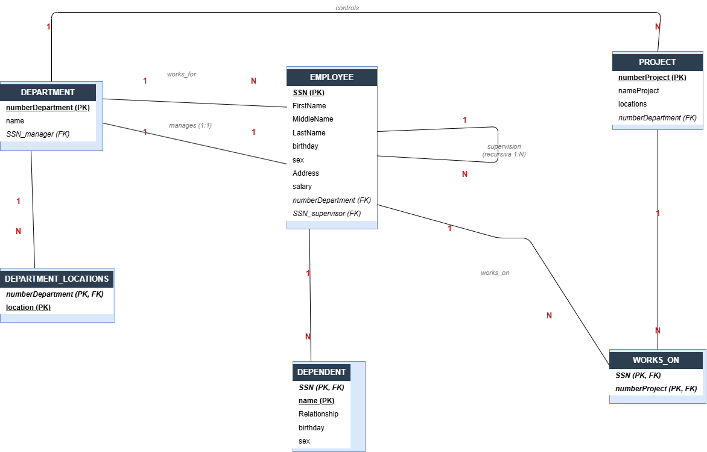

## Ejercicio 1
>de cada paciente se almacena:

-nombre del paciente

-fecha de nacimiento

-tipo de sangre

>reglas del negocio

-cada paciente debe tener exactamente un expedinete medico
#### Diagrama entidad relacion

#### Diagrama relacional

## Ejercicio 2

>2. una universidad administra

de cada profesor se almacena:

numero de profesor id 

nombre del profesor 

especialidad

>de cada curso se almacena:

nombre del curso

creditos de la materia 

>un profesor 
puede impartir varios cursos

un curso solo puede ser impartido por un profesor

puede existir un profesor que no imparta cursos

todo curso debe estar asignado a un profesor

#### Diagrama Entidad Relacion

#### Diagrama Relacional

## Ejercicio 3
> una escuela dministra alumnos y materias

de cada *Alumno* se almacena:
-matricula
-nombre
- semestre 
de cada materia se almacena *materia* 
clave de la materia
nombre de la materia
creditos
reglas del negocio
1. un alumno puede inscrbirse en varias materias
2. una materia puede tener muhos almunos inscriyos
3. puede exixtir una materi sin alumnos inscritos
4. todo alumno debe estar incrito en al menos una materia
5. de cada inscripcion se desesa almacenar:
-fecha de inscripcion:
-calificaion final
nota: a la relacion nombrarla **inscribe**

#### Diagrama Entidad Relacion

#### Diagrama Relacional

## ejercicio 4

> una empresa una empresa dedicadaa las ventas al por mayor necesita registrar lo siguiente:
numero de cliente
nombre(El cual es una persona moral)
pedidos
produicto
numero de producto
nombre 
precio
reglas del negiocio
un cliente puede realizar muchos pedidos 
cada pedido pertenece a un solo cliente 
un pedido contiene varios productos
un producto puede aparecer en muchos pedidos 
un pedido debe contener al menos un producto
un producto puede no haber sido vendido
el detalle del pedido no existe sin pedido
el detalle delm pedido no existe sin producto
el detalle almacena la cantidad vendida y el precio de venta 

#### Diagrama Entidad Relacion

#### Diagrama Relacional

## Ejercicio 5

> Departments

The company is organized into departments. Each department has:

- A unique name
- A unique number
- A manager (an employee)

Additionally, we store:

- The date when the manager started managing the department
- One or more department locations

---

> Projects

Each department controls a number of projects.

Each project has:

- A unique name
- A unique number
- A single location

---

> Employees

For each employee, we store:

- Name
- Social Security Number (SSN)
- Address
- Salary
- Sex (gender)
- Birth date

Employee relationships and assignments:

- Each employee is assigned to one department
- An employee may work on multiple projects
- Projects worked on do not necessarily belong to the employee's department
- The number of hours worked per week on each project is recorded
- Each employee has a direct supervisor (who is also an employee)

---

> Dependents

For insurance purposes, we keep track of each employee's dependents.

For each dependent, we store:

- First name
- Sex
- Birth date
- Relationship to the employee

#### Diagrama Entidad Relacion

#### Diagrama Relacional

